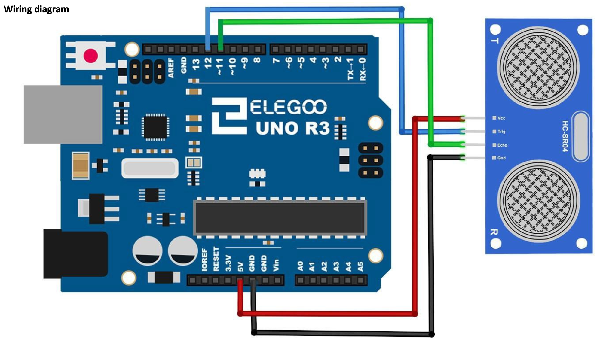

# Gesture-to-OSC Controller
## Hand Gesture + Arduino Distance Sensor → PlugData Virtual Instrument

A real-time gesture recognition and distance sensing system that maps hand postures and movements to Open Sound Control (OSC) messages for controlling a synthesizer in PlugData/Pure Data.

---

## System Architecture

```
┌─────────────────────────────────────────────────────────────────┐
│                     GESTURE-TO-OSC CONTROLLER                   │
├─────────────────────────────────────────────────────────────────┤
│                                                                 │
│  ┌──────────────┐  ┌──────────────┐  ┌──────────────┐           │
│  │  WEBCAM      │  │  ARDUINO     │  │  MEDIAPIPE   │           │
│  │  (Video)     │  │  (Distance)  │  │  (Hand Track)│           │
│  └──────┬───────┘  └──────┬───────┘  └──────┬───────┘           │
│         │                 │                 │                   │
│         └─────────────────┼─────────────────┘                   │
│                           │                                     │
│                    ┌──────▼─────────┐                           │
│                    │   MAIN.PY      │                           │
│                    │  - Classify    │                           │
│                    │  - Smooth      │                           │
│                    │  - Map OSC     │                           │
│                    └──────┬─────────┘                           │
│                           │                                     │
│                    ┌──────▼─────────┐                           │
│                    │  OSC CLIENT    │                           │
│                    │  UDP 127.0.0.1 │                           │
│                    │      :9999     │                           │
│                    └──────┬─────────┘                           │
│                           │                                     │
│                    ┌──────▼─────────┐                           │
│                    │  PLUGDATA      │                           │
│                    │  Synthesizer   │                           │
│                    │  (synth1.pd)   │                           │
│                    └────────────────┘                           │
└─────────────────────────────────────────────────────────────────┘
```

---

## Components

### 1. **Gesture Classifier** (`utils/gesture_classifier.py`)
Analyzes MediaPipe hand landmarks to determine:

#### Gesture Modes (0-4):
| Mode | Posture | OSC Mapping | Audio Effect |
|------|---------|-------------|--------------|
| **0** | Open Hand (all fingers extended) | `/synth/mode 0` | Full harmonics (Divine) |
| **1** | Closed Fist (no fingers extended) | `/synth/mode 1` | Silent |
| **2** | Fist + Thumb Out | `/synth/mode 2` | Basic + Sub-bass color (Bass) |
| **3** | Thumb + Index Extended | `/synth/mode 3` | Bright harmonic layer (Acid) |
| **4** | Thumb + Index + Middle Extended | `/synth/mode 4` | Arpeggiator |

#### Continuous Parameters:
- **Roll (Side-to-side)**: Maps to `/synth/vibrato` (0.0-1.0)
- **Distance (Near/far)**: Maps to `/synth/pitch` (0.0-1.0)

### 2. **Arduino Handler** (`utils/arduino_handler.py`)
Manages serial communication with ultrasonic distance sensor:

- **Serial Interface**: Reads distance values from Arduino (115200 baud)
- **Smoothing**: Moving average filter buffer (default: 5-sample window)
- **Range Mapping**: 5cm–50cm → 0.0–1.0 (OSC `/synth/pitch`)
- **Safety**: Validates data within physical range, panic signal sent when hands lost

### 3. **OSC Manager** (`utils/osc_manager.py`)
Handles UDP OSC message transmission to PlugData:

**OSC Addresses:**
| Address | Type | Range | Function |
|---------|------|-------|----------|
| `/synth/pitch` | float | 0.0–1.0 | Distance-based pitch control |
| `/synth/mode` | int | 0–4 | Gesture mode (discrete state) |
| `/synth/vibrato` | float | 0.0–1.0 | Hand roll (side-to-side tilt) |
| `/synth/volume` | boolean | 0.0, 1.0 | Safety volume control (0 = mute) |
| `/synth/panic` | int | 0 or 1 | Emergency stop (1 = stop) |

---

## Installation

### Prerequisites
- Python 3.11
- MacOS/Linux
- Arduino with ultrasonic distance sensor
- PlugData or Pure Data with `netreceive` listening on port 9999

### Setup Steps

1. **Install Python dependencies:**
   ```bash
   pip install -r requirements.txt
   ```

   **requirements.txt** should contain:
   ```
   opencv-python
   python-osc
   mediapipe
   pyserial
   numpy
   ```

2. **Download MediaPipe hand model:**
   See `hand_landmarker_download` file
   This creates `hand_landmarker.task` file, move it to the parent folder of this repo.

3. **Configure Arduino:**

   - Flash `arduino_handshake/arduino_handshake.ino` to your Arduino board
   - **Pins:**
     - TRIG_PIN = 12 (ultrasonic trigger)
     - ECHO_PIN = 11 (ultrasonic echo)
   - **Baud rate:** 115200


4. **Find Arduino Serial Port:**
   - **macOS**: `/dev/cu.usbserial-*` (e.g., `/dev/cu.usbserial-1130`)
   - **Linux**: `/dev/ttyUSB0` or `/dev/ttyACM0`

5. **Update `main.py`:**
   - Line 25: Set correct Arduino port if needed
   ```python
   arduino = ArduinoHandler(port='/dev/cu.usbserial-1130', smooth_window=5)
   ```

6. **Setup PlugData receiver:**
   - Open `synth/synth1.pd` in PlugData
   - Ensure `netreceive -u -l 9999` is active and the patch is running
   - OSC messages will be automatically received

---

## Running the System

1. **Start PlugData:**
   ```bash
   # Open synth/synth1.pd in PlugData
   ```

2. **Run the controller:**
   ```bash
   python main.py
   ```

3. **On-screen display shows:**
   - ✓/✗ Hand detection status
   - ✓/✗ Arduino connection status
   - Current gesture mode and name
   - Distance reading (cm and normalized 0.0-1.0)
   - Hand roll angle (degrees)

4. **Control synthesis:**
   - **Move hand closer/farther** → Control pitch
   - **Change finger configuration** → Switch synthesis mode
   - **Tilt hand side-to-side** → Modulate vibrato
   - **Remove hand from view** → Automatic volume mute (safety)

5. **Exit:**
   - Press **'q'** to quit cleanly
   - System sends `/synth/volume 0` and `/synth/panic 1` to PlugData

---

## Data Flow & Smoothing

### Arduino Distance → Pitch
```
Raw Distance (cm)
    ↓
[Moving Average Filter: 5-sample window]
    ↓
Normalized: (distance - 5) / (50 - 5) → 0.0–1.0
    ↓
/synth/pitch ← UDP OSC
```

### Hand Tilt Angles → Vibrato
```
Raw Tilt (degrees)
    ↓
[Moving Average Filter: 5-sample window]
    ↓
Roll: (-90 to 90°) → (0.0 to 1.0)
    ↓
/synth/vibrato ← UDP OSC
```

### Gesture Mode (Discrete)
```
Hand Landmarks
    ↓
Classify Posture (finger detection)
    ↓
Gesture State: 0–4 (discrete)
    ↓
/synth/mode ← UDP OSC (only on change)
```

---

## Safety Features

1. **No Hand Detection:**
   - Automatically mutes audio (`/synth/volume 0`)
   - Prevents "stuck" notes if user steps away

2. **Distance Clamping:**
   - Values outside 5–50cm are clamped to 0.0–1.0 range
   - Prevents unexpected jumps by buffering

3. **Panic Mode:**
   - On exit: sends `/synth/panic 1` and `/synth/volume 0`
   - Emergency stop if anything goes wrong

---

## License & Credits

- **MediaPipe:** Google's hand tracking library
- **python-osc:** Open Sound Control client
- **OpenCV:** Computer vision
- **Arduino:** Ultrasonic distance sensing

**Version:** 1.1  
**Last Updated:** 2026-04-14
